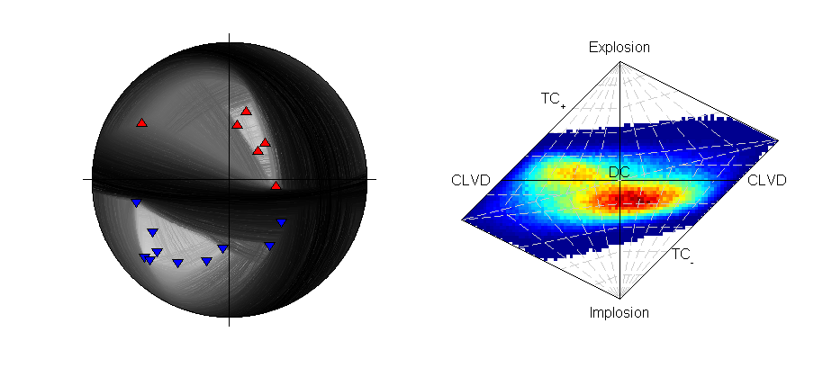
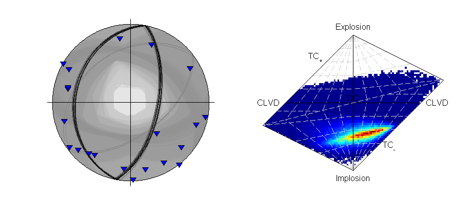
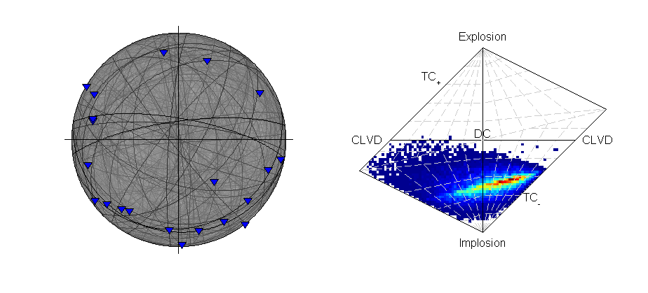

*************************************
Tutorial: Using MTfit with Real Data
*************************************

.. only:: not latex

    The :doc:`previous <tutorial>` section has introduced many of the different options available in :mod:`MTfit`. This section explains the reasoning behind the choice of these parameters using a synthetic and real example.

.. only:: latex
    
    The previous chapter has introduced many of the different options available in :mod:`MTfit`. This chapter explains the reasoning behind the choice of these parameters using synthetic and real examples.

.. only:: not latex

    The tutorials described here are:

        * :ref:`synthetic-p-polarity` - Inversion of synthetic P polarity data using Monte Carlo sampling.
        * :ref:`synthetic-ar` - Inversion of synthetic P polarity and P/SH amplitude ratio data using Monte Carlo sampling.
        * :ref:`real-p-polarity` - Inversion of real P polarity data using Monte Carlo sampling, including location uncertainty.
        * :ref:`real-p-polarity-probability` - Inversion of real P polarity probability data using Markov chain Monte Carlo sampling, including location uncertainty.
        * :ref:`bayesian-evidence` - Bayesian evidence calculation for the Monte Carlo sampled examples.
        * :ref:`relative-inversion` - Joint inversion of synthetic data using P polarities and relative P amplitude ratios using both Monte Carlo and Markov chain Monte Carlo sampling.  

.. _synthetic-event:

Synthetic Event
==================

.. only:: not latex

  .. figure:: figures/synthetic_event.png
     :figwidth: 30 %
     :width: 90%
     :align: right
     :alt: Beachball plot of the synthetic source

     *Beachball plot of the synthetic source and receiver positions for the location (Plotted using MTplot MATLAB code)*

  The synthetic event shown here has been generated from a double-couple source using a finite difference approach (:ref:`Bernth and Chapman, 2011<Bernth-2011>`). Gaussian random noise was added to the data, which were manually picked for both P and S arrival times and P polarities, and then located using `NonLinLoc <http://alomax.free.fr/nlloc>`_ and a simplified version of the known velocity model. The arrival time picks were used to automatically window and measure P, SH, and SV amplitudes.

.. only:: latex

  .. _synthetic-event-fig:

  .. figure:: figures/synthetic_event.png
     :figwidth: 50 %
     :width: 50%
     :align: center
     :alt: Beachball plot of the synthetic source

     *Beachball plot of the synthetic source and receiver positions for the location (Plotted using MTplot MATLAB code)*

  The synthetic event shown here (Fig. :ref:`5.1 <synthetic-event-fig>`)has been generated from a double-couple source using a finite difference approach (:ref:`Bernth and Chapman, 2011<Bernth-2011>`). Gaussian random noise was added to the data, which were manually picked for both P and S arrival times and P polarities, and then located using `NonLinLoc <http://alomax.free.fr/nlloc>`_ and a simplified version of the known velocity model. The arrival time picks were used to automatically window and measure P, SH, and SV amplitudes.

.. _synthetic-p-polarity:

Synthetic P Polarity Inversion
----------------------------------

There are 16 P-polarity arrivals for the synthetic event, and the locations of these receivers are shown in the figure to the right. These receivers provide quite good coverage of the focal sphere, although there is not much constraint on the fault planes due to the large spacings between receivers of contrasting polarities.

    .. literalinclude:: synthetic_p_polarity_data.txt
        :language: python

:download:`examples/synthetic_event.py <../../examples/synthetic_event.py>` contains a script for the double-couple and full moment tensor inversion of the source. It can be run as::

    $ python synthetic_event.py case=ppolarity 

Adding a ``-l`` flag will run the inversion in a single thread.

The important part of the script is:
    
    .. literalinclude:: ../../examples/synthetic_event.py
        :language: python
        :start-after: # P Polarity Inversion
        :end-before: # End
        :dedent: 8

The chosen algorithm is the ``iterate`` algorithm (see :ref:`MCsampling`) for ``100 000`` samples for the double-couple case and ``10 000 000`` for the full moment tensor inversion. 
``100 000`` samples in the double-couple space corresponds to approximately ``50`` samples in each parameter (strike, dip cosine, and rake). 
While this more dense samplings are possible, this produces a good sampling of the posterior PDF quickly, especially when run in parallel.

.. warning::

    If running this in parallel on a server, be aware that because the number of workers option ``number_workers`` is not set, as many processes as processors will be spawned, slowing down the machine for any other users.

``10 000 000`` samples for the full moment tensor inversion may seem like a coarse sampling, however, due to the higher noise level and the use of P polarity data only, there is much less constraint on the full moment tensor source PDF so this sampling still provides a good approximation of the results.

This script is equivalent to pickling the data::
    
    >>> from example_data import synthetic_event
    >>> data=synthetic_event()
    >>> import cPickle
    >>> cPickle.dump(data,open('synthetic_event_data.inv','wb'))

And then calling from the command line (Assuming parallel running: ``-l`` flag to run on a single processor)::

    $ MTfit --algorithm=iterate --pmem=1 --double-couple --max-samples=100000 \
        --inversion-options=PPolarity --convert synthetic_event_data.inv
    $ MTfit --algorithm=iterate --pmem=1 --max-samples=10000000  \
        --inversion-options=PPolarity --convert synthetic_event_data.inv

These inversions should not take long to run (running on a single core of an i5 processor, the two inversions take 2 and 72 seconds respectively), although the conversions using :mod:`MTfit.MTconvert` can add to this time, but will reduce the time when plotting the results. The solutions are outputted as a MATLAB file for the DC and MT solutions respectively, with name ``synthetic_example_event_ppolarityDC.mat`` and ``synthetic_example_event_ppolarityMT.mat`` respectively.

.. only:: latex
    
    The results are shown in Fig. :ref:`5.2 <synthetic-event-p-polarity-fig>`.

.. _synthetic-event-p-polarity-fig:

   *Beachball plot showing the fault plane orientations for the double-couple constrained inversion and the marginalised source-type PDF for the full moment tensor inversion of the synthetic data using polarities(Plotted using MTplot MATLAB code).*

.. _synthetic-ar:

Synthetic Polarity and Amplitude Ratio Inversion
-------------------------------------------------

Including amplitude ratios (``P/SH`` and ``P/SV``) in the inversion can improve the source constraint, but, as shown in :ref:`Pugh et al. 2016a <Pugh-2016a>`, the amplitude ratio can include a systematic error that is dependent on the noise level, leading to deviations from the "True" source.

.. warning::
    
    Amplitudes and amplitude ratios can show systematic deviations from the "True" value due to the noise and the method of measuring the amplitudes. Consequently, care must be taken when using amplitude ratio data in the source inversion, including tests to see if the different amplitude ratios are consistent with each other and the polarity only inversion.

These tests are ignored in this example, but can lead to very sparse solutions in the source inversion.

:download:`examples/synthetic_event.py<../../examples/synthetic_event.py>` contains a script for the double-couple and full moment tensor inversion of the source. It can be run as::

    $ python synthetic_event.py case=ar 

Adding a ``-l`` flag will run the inversion in a single thread.

The important part of the script is:
    
    .. literalinclude:: ../../examples/synthetic_event.py
        :language: python
        :start-after: # Amplitude Ratio Inversion
        :end-before: # End
        :dedent: 8

The chosen algorithm is the ``iterate`` algorithm (see :ref:`MCsampling`) for ``100 000`` samples for the double-couple case and ``50 000 000`` for the full moment tensor inversion. 
``100 000`` samples in the double-couple space corresponds to approximately ``50`` samples in each parameter (strike, dip cosine, and rake). 
While this more dense samplings are possible, this produces a good sampling of the posterior PDF quickly, especially when run in parallel.

.. warning::

    If running this in parallel on a server, be aware that because the number of workers option ``number_workers`` is not set, as many processes as processors will be spawned, slowing down the machine for any other users.

``50 000 000`` samples are used instead of the ``10 000 000`` samples in the :ref:`synthetic-p-polarity` example because amplitude ratios provide a much stronger constraint on the source type, so more samples are required for an effective sampling of the source PDF.

This script is equivalent to pickling the data::
    
    >>> from example_data import synthetic_event
    >>> data=synthetic_event()
    >>> import cPickle
    >>> cPickle.dump(data,open('synthetic_event_data.inv','wb'))

And then calling from the command line (Assuming parallel running: ``-l`` flag to run on a single processor)::

    $ MTfit --algorithm=iterate --pmem=1 --double-couple --max-samples=100000 \
        --inversion-options=PPolarity,P/SHRMSAmplitudeRatio,P/SVRMSAmplitudeRatio \
        --convert synthetic_event_data.inv
    $ MTfit --algorithm=iterate --pmem=1 --max-samples=10000000  \
        --inversion-options=PPolarity,P/SHRMSAmplitudeRatio,P/SVRMSAmplitudeRatio \
        --convert synthetic_event_data.inv

These inversions should not take long to run (running on a single core of an i5 processor, the two inversions take 20 and 436 seconds respectively), although the conversions using :mod:`MTfit.MTconvert` can add to this time, but will reduce the time when plotting the results. These run times are longer than for only polarity data, both because of the additional data, and the increased complexity of the :ref:`ratio-pdf-label`. The solutions are outputted as a MATLAB file for the DC and MT solutions respectively, with name ``synthetic_example_event_arDC.mat`` and ``synthetic_example_event_arMT.mat`` respectively.

.. only:: latex
    
    The results are shown in Fig. :ref:`5.3 <synthetic-event-ar-fig>`.

.. _synthetic-event-ar-fig:

.. figure:: figures/synthetic_event_ar.png
   :figwidth: 70 %
   :width: 90%
   :align: center
   :alt: Beachball plot showing the fault plane orientations for the double-couple constrained inversion and the marginalised source-type PDF for the full moment tensor inversion of the synthetic data.

   *Beachball plot showing the fault plane orientations for the double-couple constrained inversion and the marginalised source-type PDF for the full moment tensor inversion of the synthetic data using polarities and amplitude ratios (Plotted using MTplot MATLAB code).*

Krafla Event
==================
.. only:: not latex

  .. figure:: figures/krafla_event_location_uncertainty.png
     :figwidth: 30 %
     :width: 90%
     :align: right
     :alt: Beachball plot of the krafla location uncertainty

     *Beachball plot of the effect of the location uncertainty on the receivers (dots, darker are higher probability locations) (Plotted using MTplot MATLAB code)*

  A strongly non-double-couple event, with manually picked P and S arrival times and P polarities, and then located using `NonLinLoc <http://alomax.free.fr/nlloc>`_ is used as an example for inversions with real data. In this case the S arrivals were hard to measure an amplitude for, so amplitude ratios are ignored. Instead, polarities and polarity probabilities (calculated using the approach described in :ref:`Pugh et al. 2016a<Pugh-2016a>` and implemented in :ref:rom :mod:`autopol`) are used separately to invert for the source, along with including the location data. This event is shown in :ref:`Pugh et al. 2016a<Pugh-2016a>` and investigated in more detail in :ref:`Watson et al. 2015<Watson-2015>`.

.. only:: latex

  .. _krafla-event-location-uncertainty:

  .. figure:: figures/krafla_event_location_uncertainty.png
     :figwidth: 50 %
     :width: 50%
     :align: center
     :alt: Beachball plot of the krafla location uncertainty

     *Beachball plot of the effect of the location uncertainty on the receivers (dots, darker are higher probability locations) (Plotted using MTplot MATLAB code)*

  A strongly non-double-couple event, with manually picked P and S arrival times and P polarities, and then located using `NonLinLoc <http://alomax.free.fr/nlloc>`_ is used as an example for inversions with real data. In this case the S arrivals were hard to measure an amplitude for, so amplitude ratios are ignored. Instead, polarities and polarity probabilities (calculated using the approach described in :ref:`Pugh et al. 2016a<Pugh-2016a>` and implemented in :ref:rom :mod:`autopol`) are used separately to invert for the source, along with including the location data (Fig. :ref:`5.4 <krafla-event-location-uncertainty>`). This event is shown in :ref:`Pugh et al. 2016a<Pugh-2016a>` and investigated in more detail in :ref:`Watson et al. 2015<Watson-2015>`.

.. _real-p-polarity:

Krafla P Polarity Inversion
-----------------------------

There are 21 P-polarity arrivals for the synthetic event, and the locations of these receivers are shown in the figure on the right. There is quite a large depth uncertainty, leading to a large variation in take-off angles (also shown in the figure on the right)

    .. literalinclude:: krafla_p_polarity_data.txt
        :language: python

:download:`examples/krafla_event.py<../../examples/krafla_event.py>` contains a script for the double-couple and full moment tensor inversion of the source. It can be run as::

    $ python krafla_event.py case=ppolarity 

Adding a ``-l`` flag will run the inversion in a single thread.

The important part of the script is:
    
    .. literalinclude:: ../../examples/krafla_event.py
        :language: python
        :start-after: # P Polarity Inversion
        :end-before: # End
        :dedent: 8

In this example the :func:`MTfit.__core__.MTfit`  function is used instead of creating the inversion object directly. Again, the chosen algorithm is the ``iterate`` algorithm (see :ref:`MCsampling`) for ``100 000`` samples for the double-couple case and ``1 000 000`` for the full moment tensor inversion. The location uncertainty distribution is binned (``--bin_scatangle``), which runs before the main inversion is carried out. This uses the :doc:`source-scatangle` extension to both parse and bin the location PDF distribution.

.. warning::

    If running this in parallel on a server, be aware that because the number of workers option ``number_workers`` is not set, as many processes as processors will be spawned, slowing down the machine for any other users.

This script is equivalent to pickling the data::
    
    >>> from example_data import krafla_event
    >>> data=krafla_event()
    >>> import cPickle
    >>> cPickle.dump(data,open('krafla_event_data.inv','wb'))

And then calling from the command line (Assuming parallel running: ``-l`` flag to run on a single processor)::

    $ MTfit --location_pdf_file_path=krafla_event.scatangle --algorithm=iterate \
        --pmem=1 --double-couple --max-samples=100000 --inversion-options=PPolarity \
        --convert --bin-scatangle krafla_event_data.inv
    $ MTfit --location_pdf_file_path=krafla_event.scatangle --algorithm=iterate \
        --pmem=1 --max-samples=10000000  --inversion-options=PPolarity --convert \
        --bin-scatangle krafla_event_data.inv
        
These inversions will take longer to run than the previous examples, due to the location uncertainty (running using 8 cores, the two inversions take 4 and 11 minutes respectively), although the conversions using :mod:`MTfit.MTconvert` can add to this time, but will reduce the time when plotting the results. The solutions are outputted as a MATLAB file for the DC and MT solutions respectively, with name ``krafla_event_ppolarityDC.mat`` and ``krafla_event_ppolarityMT.mat`` respectively.

.. only:: latex
    
    Fig. :ref:`5.5<krafla-event-p-polarity>` shows the results plotted using MATLAB.

.. _krafla-event-p-polarity:

   *Beachball plot showing the fault plane orientations for the double-couple constrained inversion and the marginalised source-type PDF for the full moment tensor inversion of the krafla data using polarities(Plotted using MTplot MATLAB code).*

.. _real-p-polarity-probability:

Krafla P Polarity Probability Inversion
-----------------------------------------

There are 21 P-polarity arrivals for the synthetic event, but more observations, and a better understanding of the uncertainties on the polarities can be obtained using the automated Bayesian polarity probabilities generated using the approach described in :ref:`Pugh et al., 2016b<Pugh-2016b>`, :ref:`Pugh, 2016a <Pugh-2016ax>`. Nevertheless, much of this example is the same as the :ref:`real-p-polarity` example.

:download:`examples/krafla_event.py<../../examples/krafla_event.py>` contains a script for the double-couple and full moment tensor inversion of the source. It can be run as::

    $ python krafla_event.py case=ppolarityprob

Adding a ``-l`` flag will run the inversion in a single thread.

The important part of the script is:
    
    .. literalinclude:: ../../examples/krafla_event.py
        :language: python
        :start-after: # Polarity Probability Inversion
        :end-before: # End
        :dedent: 8

In this example the :func:`MTfit.__core__.MTfit`  function is used instead of creating the inversion object directly. The chosen algorithm is the ``mcmc`` algorithm (see :ref:`McMCsampling`) for a chain length of ``100 000`` samples for both the double-couple case and the full moment tensor inversion. Additionally a trans-dimensional McMC approach is run, allowing comparison between the two.

.. only:: latex

    The location uncertainty distribution is binned (``--bin_scatangle``), which runs before the main inversion is carried out. This uses the :download:`extensions/scatangle.py<../../extensions/scatangle.py>` extension to both parse and bin the location PDF distribution.

.. only:: not latex

    The location uncertainty distribution is binned (``--bin_scatangle``), which runs before the main inversion is carried out. This uses the :doc:`source-scatangle` extension to both parse and bin the location PDF distribution.

.. warning::

    If running this in parallel on a server, be aware that because the number of workers option ``number_workers`` is not set, as many processes as processors will be spawned, slowing down the machine for any other users.

This script is equivalent to pickling the data::
    
    >>> from example_data import krafla_event
    >>> data=krafla_event()
    >>> import cPickle
    >>> cPickle.dump(data,open('krafla_event_data.inv','wb'))

And then calling from the command line::

      $ MTfit --location_pdf_file_path=krafla_event.scatangle -l --algorithm=mcmc -b \
          --pmem=1 --double-couple --max-samples=100000 --inversion-options=PPolarityProb \
          --convert --bin-scatangle krafla_event_data.inv
      $ MTfit --location_pdf_file_path=krafla_event.scatangle -l --algorithm=transdmcmc \
          --pmem=1 --max-samples=100000  --inversion-options=PPolarityProb --convert \
          --bin-scatangle krafla_event_data.inv
            
These inversions will take longer to run than the previous examples, both due to the location uncertainty, the McMC algorithms, and the non-parallel running (running on a single process on an i5 processor, the  inversions take 7 hours), although the conversions using :mod:`MTfit.MTconvert` can add to this time, but will reduce the time when plotting the results. The solutions are outputted as a MATLAB file for the DC and MT solutions respectively, with name ``krafla_event_ppolarityDC.mat`` and ``krafla_event_ppolarityMT.mat`` respectively. 

.. only:: latex
    
    Fig. :ref:`5.6<krafla-event-p-polarity-prob>` shows the results plotted using MATLAB.

.. _krafla-event-p-polarity-prob:

   *Beachball plot showing the fault plane orientations for the double-couple constrained inversion and the marginalised source-type PDF for the full moment tensor inversion of the krafla data using polarity probabilities (Plotted using MTplot MATLAB code).*

The ``transdmcmc`` algorithm option produces similar results to the normal McMC example, and both results are consistent with the random sampling approach for polarity data (:ref:`Krafla P Polarity<real-p-polarity>`). The chain-lengths may be on the long side, and it is possible that shorter chains would produce satisfactory sampling of the solution PDF. 

.. only:: latex
    
    Fig. :ref:`5.7<krafla-event-p-polarity-prob-transd>` shows the results for the ``transdmcmc`` inversion plotted using MATLAB.

.. _krafla-event-p-polarity-prob-transd:

.. only:: latex
    
    .. figure:: figures/krafla_event_p_polarity_probability_transd.png
       :figwidth: 70 %
       :width: 60%
       :align: center
       :alt: The marginalised source-type PDF for the full moment tensor inversion of the krafla data.

       *The marginalised source-type PDF for the full moment tensor inversion of the krafla data using polarity probabilities and the reversible jump (trans-dimensional) McMC approach (Plotted using MTplot MATLAB code).*
    
.. only:: not latex

    .. figure:: figures/krafla_event_p_polarity_probability_transd.png
       :figwidth: 40 %
       :width: 90%
       :align: right
       :alt: The marginalised source-type PDF for the full moment tensor inversion of the krafla data.

       *The marginalised source-type PDF for the full moment tensor inversion of the krafla data using polarity probabilities and the reversible jump (trans-dimensional) McMC approach (Plotted using MTplot MATLAB code).*

.. _bayesian-evidence:

Bayesian Evidence
======================

The Bayesian evidence estimates the evidence for the model given the posterior PDF and the parameter priors. It accounts for the model dimensions, and can penalise the higher dimensional model by the parameter priors. The Bayesian evidence is:

.. math::

  \mathrm{p}\left(data|model\right)=\int_\mathrm{x}\mathrm{p}\left(data|x\right)\mathrm{p}\left(x|model\right)\mathrm{d}x.

Since :mod:`MTfit` produces random samples of the source PDF, so the Bayesian evidence is calculated as a sum over the samples:

.. math::

  \mathrm{p}\left(data|model\right)=\sum_{x}\mathrm{p}\left(data|x\right)\mathrm{p}\left(x|model\right)\delta x,

but care must be taken with the choice of the prior parameterisation. This must correspond to the same parameterisation in which the Monte Carlo samples were drawn, either directly or by correcting both the prior distribution and the :math:`\delta x` values. A Monte Carlo approach can be affected by small sample sizes in the integration, which is sometimes the case when the source PDF is dominated by a few very large probability samples.

:mod:`MTfit` produces a Bayesian evidence estimate for a constrained inversion. These can be combined for the DC and MT models, with :math:`\mathcal{B}` corresponding to a Bayesian evidence estimate:

.. math::

  \mathrm{ln}\left(\mathcal{B}_\mathrm{max}\right)=\mathrm{max}\left(\mathrm{ln}\left(\mathcal{B}_\mathrm{DC}\right),\mathrm{ln}\left(\mathcal{B}_\mathrm{MT}\right)\right),\\
  p_\mathrm{DC}=\frac{\mathrm{e}^{\mathrm{ln}\left(\mathcal{B}_\mathrm{DC}\right)-\mathrm{ln}\left(\mathcal{B}_\mathrm{max}\right)}}{\mathrm{e}^{\mathrm{ln}\left(\mathcal{B}_\mathrm{DC}\right)-\mathrm{ln}\left(\mathcal{B}_\mathrm{max}\right)}+\mathrm{e}^{\mathrm{ln}\left(\mathcal{B}_\mathrm{MT}\right)-\mathrm{ln}\left(\mathcal{B}_\mathrm{max}\right)}},\\
  p_\mathrm{MT}=\frac{\mathrm{e}^{\mathrm{ln}\left(\mathcal{B}_\mathrm{MT}\right)-\mathrm{ln}\left(\mathcal{B}_\mathrm{max}\right)}}{\mathrm{e}^{\mathrm{ln}\left(\mathcal{B}_\mathrm{DC}\right)-\mathrm{ln}\left(\mathcal{B}_\mathrm{max}\right)}+\mathrm{e}^{\mathrm{ln}\left(\mathcal{B}_\mathrm{MT}\right)-\mathrm{ln}\left(\mathcal{B}_\mathrm{max}\right)}}.

For the examples shown above, the model probability estimates from the Bayesian evidence are:

+--------------------------------------------------------------+----------------------+----------------------+
|Example                                                       |:math:`p_\mathrm{DC}` |:math:`p_\mathrm{MT}` |
+==============================================================+======================+======================+
|:ref:`Synthetic Polarities<synthetic-p-polarity>`             |:math:`0.64`          |:math:`0.36`          |
+--------------------------------------------------------------+----------------------+----------------------+
|:ref:`Synthetic Polarity and Amplitude Ratios <synthetic-ar>` |:math:`0.82`          |:math:`0.18`          |
+--------------------------------------------------------------+----------------------+----------------------+
|:ref:`Krafla P Polarity<real-p-polarity>`                     |:math:`0.0008`        |:math:`0.9992`        |
+--------------------------------------------------------------+----------------------+----------------------+

These can be calculated using the :func:`MTfit.probability.model_probabilities` function, which takes the logarithm of the Bayesian evidence for each model type as an argument:

.. autofunction:: MTfit.probability.model_probabilities

The normal McMC approach cannot be used to estimate the model probabilities, however the trans-dimensional example is consistent with the :ref:`Krafla P Polarity<real-p-polarity>` model probabilities as that produces an estimate :math:`p_\mathrm{DC}=0`.

:mod:`MTfit` also calculates the Kullback-Liebler divergence of the resultant PDF from the sampling prior, which is a measure of how much difference there is between the resultant PDF and the prior information. This is outputted during the inversion approach (when using Monte Carlo random sampling), and saved to the output file.

.. _relative-inversion:

Joint Inversion
======================

:mod:`MTfit` can also carry out joint invesions and include relative amplitude data (:ref:`Pugh et al., 2015t <Pugh-2015t>`). This examples uses data from two co-located synthetic events with overlapping receivers.  
:download:`examples/relative_event.py<../../examples/relative_event.py>` contains a script for the double-couple and full moment tensor inversion of the source. It can be run as::

    $ python relative_event.py

Adding a ``-l`` flag will run the inversion in a single thread.

The important part of the script is:
    
    .. literalinclude:: ../../examples/relative_event.py
        :language: python
        :start-after: # P Polarity and Relative P Amplitude Inversion
        :end-before: # End
        :dedent: 4

In this example the :class:`MTfit.inversion.Inversion`  class is created directly. The chosen algorithm for the double-couple inversion is the ``iterate`` algorithm (see :ref:`MCsampling`) for ``10 000 000`` samples for the double-couple case. A large sample size is required when running the joint inversion because if the probabilities of obtaining a non-zero probability sample for both events is less than or equal to the product of the probabilities of obtaining a non-zero probability sample for the events individually, i.e if the fraction of non-zero probability samples for event 1 is :math:`f_1` and the fraction for event 2 is :math:`f_2`, then the fraction for the joint samping :math:`f_j \leq f_1.f_2`. Consequently it soon becomes infeasible to run the monte-carlo sampling algorithm for the full moment tensor case.

The full moment tensor inversion uses the ``mcmc`` algorithm to reduce the dependence of the result on the sample size. The burn in length is set to ``30 000`` and the chain length to ``100 000``, while the targeted  acceptance rate window is reduced from the normal McMC selection (0.3 - 0.5), instead targetting between 0.1 and 0.3.

.. warning::

    If running this in parallel on a server, be aware that because the number of workers option ``number_workers`` is not set, as many processes as processors will be spawned, slowing down the machine for any other users.

This script is equivalent to pickling the data::

    >>> from example_data import relative_event
    >>> data=relative_event()
    >>> import cPickle
    >>> cPickle.dump(data,open('relative_event_data.inv','wb')) 

And then calling from the command line::

      $ MTfit --algorithm=iterate --pmem=1 --double-couple --max-samples=10000000 \
          --inversion-options=PPolarity,PAmplitude --convert --relative \
          --multiple-events relative_event_data.inv

      $ MTfit --algorithm=mcmc --pmem=1 --chain-length=100000  \
          --burn_in=30000 --min_acceptance_rate=0.1 \
          --max_acceptance_rate=0.3 --inversion-options=PPolarity,PAmplitude \
          --convert --relative --multiple-events relative_event_data.inv
            
These inversions will take longer to run than the previous examples, due to the increased sample size required for the joint PDF. The solutions are outputted as a MATLAB file for the DC and MT solutions respectively, with name ``MTfitOutput_joint_inversionDC.mat`` and ``MTfitOutput_joint_inversionMT.mat`` respectively.

.. only:: not latex

    .. figure:: figures/joint_event.png
       :figwidth: 60 %
       :width: 90%
       :align: center
       :alt: Beachball plot showing the fault plane orientations for the double-couple constrained inversion and the marginalised source-type PDF for the full moment tensor inversion of the relative data.

       *Beachball plot showing the fault plane orientations for the double-couple constrained inversion and the marginalised source-type PDF for the full moment tensor inversion for two events, inverted  using P polarities and relative P amplitude ratios.* 

    These have improved the constraint compared to the joint inversion without relative amplitudes:

.. only:: latex
    
    Fig. :ref:`5.8<joint-event>` shows the results plotted using the plot module of :mod:`MTfit`.

    .. _joint-event:

    .. figure:: figures/joint_event.png
       :width: 60%
       :align: center
       :alt: Beachball plot showing the fault plane orientations for the double-couple constrained inversion and the marginalised source-type PDF for the full moment tensor inversion of the relative data.

       *Beachball plot showing the fault plane orientations for the double-couple constrained inversion and the marginalised source-type PDF for the full moment tensor inversion for two events, inverted  using P polarities and relative P amplitude ratios.*

    These have improved the constraint compared to the joint inversion without relative amplitudes (Fig. :ref:`5.9<joint-event-no-rel>`).

.. only:: not latex

    .. figure:: figures/joint_event_no_rel.png
       :figwidth: 60 %
       :width: 90%
       :align: center
       :alt: Beachball plot showing the fault plane orientations for the double-couple constrained inversion and the marginalised source-type PDF for the full moment tensor inversion of the P-polarities.

       *Beachball plot showing the fault plane orientations for the double-couple constrained inversion and the marginalised source-type PDF for the full moment tensor inversion for two events, inverted  using P polarities.*

.. only:: latex

    .. _joint-event-no-rel:

    .. figure:: figures/joint_event_no_rel.png
       :width: 60%
       :align: center
       :alt: Beachball plot showing the fault plane orientations for the double-couple constrained inversion and the marginalised source-type PDF for the full moment tensor inversion of the P-polarities.

       *Beachball plot showing the fault plane orientations for the double-couple constrained inversion and the marginalised source-type PDF for the full moment tensor inversion for two events, inverted  using P polarities.*

Althought the constraint has improved, the relative amplitudes have changed the full moment tensor solution for the second event, possibly due to errors in the P-amplitude estimation (:ref:`Pugh et al., 2016a<Pugh-2016a>`).